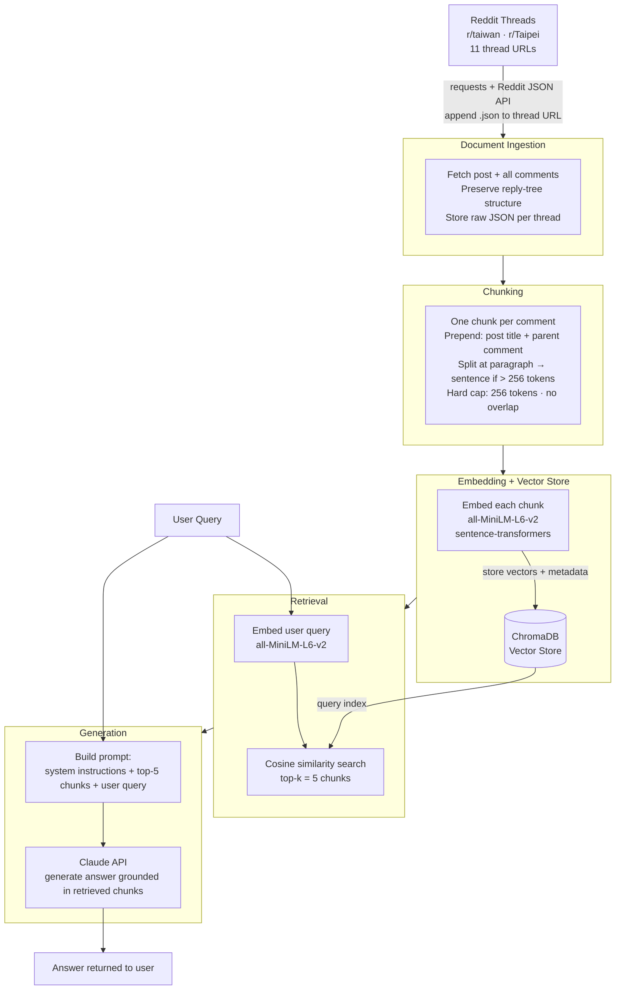

# Project 1 Planning: The Unofficial Guide

> Write this document before you write any pipeline code.
> Your spec and architecture diagram are what you'll use to direct AI tools (Claude, Copilot, etc.) to generate your implementation — the more specific they are, the more useful the generated code will be.
> Update the Retrieval Approach and Chunking Strategy sections if you change your approach during implementation.
> Update this file before starting any stretch features.

---

## Domain

My chosen domain is the **living and studying abroad experience in Taipei, Taiwan**, targeted at students participating in exchange programs. This knowledge is valuable because official school channels (study abroad offices, program brochures) only provide curated, surface-level information. Real insights — actual monthly budgets, cultural surprises, food recommendations, and day-to-day logistics — come from people who have lived it. Reddit communities like r/taiwan and r/Taipei aggregate candid, first-hand accounts from expats, exchange students, and long-term residents, covering topics that official sources rarely address: realistic cost breakdowns, culture shock moments, neighborhood tips, and social experiences. This makes the knowledge both hard to find through official channels and highly practical for students preparing for a semester or year abroad.

---

## Documents

<!-- List your specific sources: URLs, subreddit names, forum threads, or file descriptions.
     Aim for at least 10 sources that together cover different subtopics or perspectives within your domain. -->

| #   | Source                 | Description                                          | URL or location                                                                                     |
| --- | ---------------------- | ---------------------------------------------------- | --------------------------------------------------------------------------------------------------- |
| 1   | r/taiwan Reddit thread | Student living expenses breakdown                    | https://www.reddit.com/r/taiwan/comments/1rsrvkp/students_living_expenses/                          |
| 2   | r/Taipei Reddit thread | Cost of living in Taipei discussion                  | https://www.reddit.com/r/Taipei/comments/1l65xjy/cost_of_living_in_taipei/                          |
| 3   | r/taiwan Reddit thread | Living costs as a student in Taiwan                  | https://www.reddit.com/r/taiwan/comments/1mchc8q/living_cost_as_a_student/                          |
| 4   | r/Taipei Reddit thread | Things to know before moving to Taipei               | https://www.reddit.com/r/Taipei/comments/1qna074/all_the_things_i_wish_i_knew_before_moving_to/     |
| 5   | r/taiwan Reddit thread | Stereotypes Taiwanese have about foreigners          | https://www.reddit.com/r/taiwan/comments/1tidhl4/stereotypes_that_taiwanese_have_about_other/       |
| 6   | r/taiwan Reddit thread | Culture shocks experienced in Taiwan                 | https://www.reddit.com/r/taiwan/comments/1fzjrzg/what_are_some_culture_shocks_in_taiwan/            |
| 7   | r/taiwan Reddit thread | Must-try food and restaurants in Taipei              | https://www.reddit.com/r/taiwan/comments/1l67an4/must_try_food_or_restaurant_in_taipei/             |
| 8   | r/Taipei Reddit thread | Unique restaurants in Taipei recommendations         | https://www.reddit.com/r/Taipei/comments/1nft36e/unique_restaurants_in_taipei/                      |
| 9   | r/taiwan Reddit thread | Exchange student in Taiwan experience recap          | https://www.reddit.com/r/taiwan/comments/1s4faq3/i_am_an_exchange_student_in_taiwan_here_iswhat/    |
| 10  | r/taiwan Reddit thread | Foreigners share what brought them to Taiwan         | https://www.reddit.com/r/taiwan/comments/1rv58kr/foreigners_what_are_you_doing_here/                |
| 11  | r/taiwan Reddit thread | Things foreigners do in Taiwan they recommend to all | https://www.reddit.com/r/taiwan/comments/1as5dki/what_thing_do_you_do_in_taiwan_that_you_think_all/ |

---

## Chunking Strategy

<!-- How will you split documents into chunks?
     State your chunk size (in tokens or characters), overlap size, and explain why those
     numbers fit the structure of your documents.
     A review-heavy corpus warrants different chunking than a long FAQ. -->

**Chunk size:** 200–256 tokens per chunk (roughly 150–200 words), hard-capped at 256 tokens to match the context window of `all-MiniLM-L6-v2`. 

**Overlap:**  No token overlap between adjacent comment chunks. Instead, context continuity is preserved through metadata prepending — each chunk carries its post title and direct parent comment as header text. This is functionally equivalent to overlap but semantically richer for Reddit's tree structure.

**Reasoning:** Reddit threads are not linear documents — they are reply trees where a comment's meaning often depends on its parent. Fixed overlap (e.g., repeating the last 50 tokens of chunk N into chunk N+1) fails here because adjacent chunks in a flat list are not necessarily related; a sibling comment is no more contextually relevant than a random other comment. Structure-aware preprocessing solves this more precisely: every chunk is made self-contained by injecting its direct ancestor chain as a header, so a retriever pulling any single chunk gets enough context to answer from it without needing the surrounding chunks. Chunk size is kept under 500 tokens to avoid bundling multiple distinct opinions into one embedding, which would dilute retrieval precision — each chunk should represent one person's single point.

---

## Retrieval Approach

<!-- Which embedding model are you using (e.g., all-MiniLM-L6-v2 via sentence-transformers)?
     How many chunks will you retrieve per query (top-k)?
     If you were deploying this for real users and cost wasn't a constraint, what tradeoffs
     would you weigh in choosing a different embedding model — context length, multilingual
     support, accuracy on domain-specific text, latency? -->

**Embedding model:** all-MiniLM-L6-v2 via sentence-transformers

**Top-k:** $k=5$, since Reddit answers to a single question may be scattered across a few comments, but we also wouldn't want too many off-topic comments to be included.

**Production tradeoff reflection:** Probably a stronger model that can handle more tokens is better for dense, multiparapgraphed posts and can capture the context better. If we consider that we need another language, then `all-MiniLM-L6-v2` is not enough since it's English only. In addition, some specific terms, like MRT, NT, scooter culture, etc. might not be semantically captured with a general English model.

---

## Evaluation Plan

<!-- List your 5 test questions with their expected correct answers.
     Questions should be specific enough that you can judge whether the system's response
     is right or wrong. "What are good dining halls?" is too vague.
     "What do students say about wait times at [dining hall name] during lunch?" is testable. -->

| #   | Question | Expected answer |
| --- | -------- | --------------- |
| 1   | What are some cultural shocks students can expect living in Taiwan? | Lining up for garbage trucks at scheduled times, people are generally very friendly and helpful, apartments may have mold/dust issues due to high humidity, chaotic traffic with scooters dominating the roads. |
| 2   | What are some must-try foods in Taiwan? | Beef noodle soup, xiaolongbao (soup dumplings), gua bao (pork belly buns), popcorn chicken, shaved ice (baobing), stinky tofu; most are cheap and widely available at night markets. |
| 3   | What should I know before going to Taipei as a student? | Get an EasyCard for the MRT and buses, expect hot and humid weather especially in summer, explore night markets for affordable food, visit Jiufen, Elephant Mountain, and Longshan Temple. |
| 4   | What activities do foreigners in Taiwan think all visitors should try? | Hiking (Elephant Mountain, Yangmingshan), renting a YouBike for cycling along the riverside, riding the MRT around the city, visiting night markets, and taking a day trip outside Taipei. |
| 5   | What is the estimated monthly living cost for a student in Taipei? | Budget students can manage on around 15,000–20,000 NTD/month covering food and transport; a more comfortable lifestyle with rent runs 25,000–30,000 NTD/month depending on accommodation type and neighborhood. |

---

## Anticipated Challenges

<!-- What could go wrong? Name at least two specific risks with reasoning.
     Consider: noisy or inconsistent documents, missing source attribution, off-topic
     retrieval, chunks that split key information across boundaries. -->

1. Using Reddit threads as the source: there might be noise and low-quality comments. Some answers might also be outdated and do not reflect the current trend (e.g., cost, rent price, etc.)

2. using `all-MiniLM-L6-v2` model: longer comments might be cut mid-sentence, and terms like "EasyCard" or "NT$" might map poorly. The 256-token budget limit is also kind of tight.

---

## Architecture

<!-- Draw a diagram of your pipeline showing the five stages:
     Document Ingestion → Chunking → Embedding + Vector Store → Retrieval → Generation
     Label each stage with the tool or library you're using.
     You can use ASCII art, a Mermaid diagram, or embed a sketch as an image.
     You'll use this diagram as context when prompting AI tools to implement each stage. -->

---

## AI Tool Plan

<!-- For each part of the pipeline below, describe:
     - Which AI tool you plan to use (Claude, Copilot, ChatGPT, etc.)
     - What you'll give it as input (which sections of this planning.md, which requirements)
     - What you expect it to produce
     - How you'll verify the output matches your spec

     "I'll use AI to help me code" is not a plan.
     "I'll give Claude my Chunking Strategy section and ask it to implement chunk_text()
     with my specified chunk size and overlap" is a plan. -->

**Milestone 3 — Ingestion and chunking:**

**Milestone 4 — Embedding and retrieval:**

**Milestone 5 — Generation and interface:**
